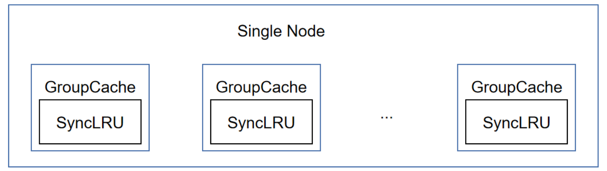
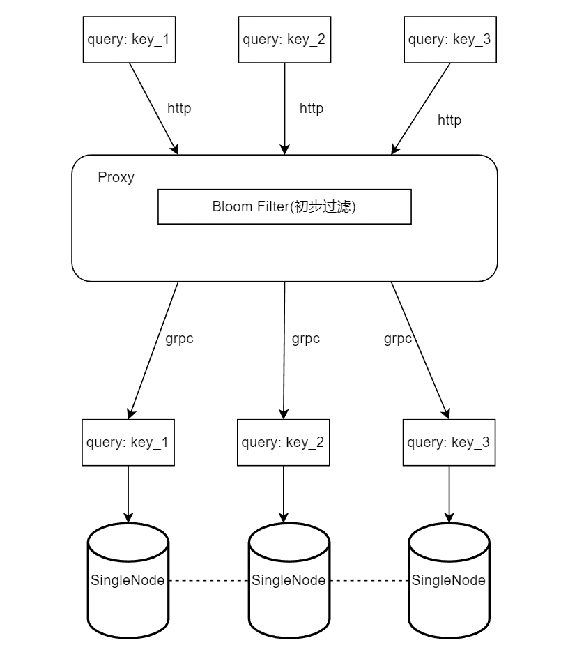

## 基于一致性哈希实现一个分布式缓存

### 目录说明
- common/ 中存放的是公共的代码，例如group_cache【单机】
- consistenhash/ 中存放的是一致性哈希的代码
- kvholder/ 中存放的是底层的SingleNode的代码  独立的程序
- proxy/ 中存放的是无状态路由层的代码    独立的程序

### 单节点架构如下：

### 整体架构如下：

### 测试方法
- 进入到kv-holder下面，使用"./run.sh 10051"、"./run.sh 10052"、"./run.sh 10053"启动三个holder
- 进入到proxy下面，使用"./run.sh 10050"启动proxy
- 然后按照如下规则访问即可：
写 localhost:10050/kvcache/{group_name}/{key}/{val} 
读 localhost:10050/kvcache/{group_name}/{key}

例如： 
首先访问 localhost:10050/kvcache/gname_1/key_1/val_1 表示向 gname_1 组中写入(key_1, val_1)
然后访问 localhost:10050/kvcache/gname/key_1 表示查询 key_1 对应的值，应该返回 val_1

## 参考
[1] https://geektutu.com/post/geecache.html